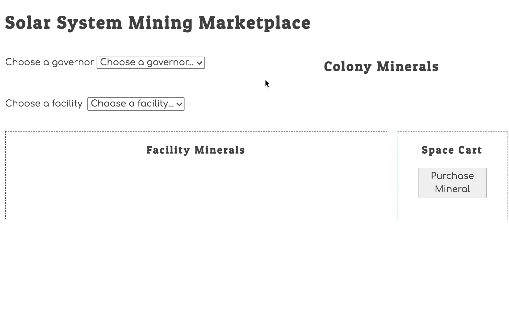

# Exomine

This web application lets governors purchase minerals for their colony one ton at a time from a facility they specify. The application also tracks the mineral inventory for each colony in the database, as well as tracks the inventory of minerals for each facility.

MODULE RESPONSIBILITIES:
(**Please see commented code within each module for a deeper understanding of each component**)

main.js - Responsible for rendering all of our HTML on page load as well as when listening for customEvents that were dispatched during a state change

Exomine.js - Responsible for declaring and exporting our Exomine() function that generates all of the HTML. It also listens for the purchase button click event

Colonies.js - Responsible for declaring and exporting our Colony() function that generates the name of each colony on the page in a dynamic way

Governors.js - Responsible for declaring and exporting our Governors() function. This function generates each object in the governors array from the database as HTML (drop down options). There is also a change eventListener that is responsible for calling our setColony() function when a governor is selected

Facilities.js - Responsible for declaring and exporting our Facilities() function. This function generates each object in the facilities array from the database as HTML (drop down options). There is also a change eventListener that is responsible for calling our setFacility() function when a facility is selected

ColonyMinerals.js - Responsible for declaring and exporting our ColonyMinerals() function. This function generates the objects in the colonyMinerals array from the database as HTML in a dynamic way (HTML list items, dependent upon which governor is selected in the drop down)

FacilityMinerals.js - Responsible for declaring and exporting our FacilityMinerals() function. This function generates the objects in the facilityMinerals array from the database as HTML in a dynamic way (HTML radio buttons, dependent upon which facility is selected in the drop down). We also have an eventListener in here that calls the setMineral() function when the user selects a mineral from one of the radio buttons

cart.js - Responsible for declaring and exporting our SpaceCart() function. This function generates the mineral selected with a radio button from a specific facility as HTML (a string nested in a div. Ex. "1 ton of Plutonium from Red Hawk facility") 

database.js - Responsible for storing all of our state (permanent and transient). We also have declared and exported our Get and Set functions within this module. The Get functions allow us to access copies of data throughout the other modules. The Set functions add key:value pairs to our transientState object when they are called. (i.e. when we recieve input from a user via a drop down or radio button). Lastly, we also declared and exported our purchaseMineral() function. This function is called during the purchase button click event (see the eventListener in Exomine.js). When called, the function will either add 1 to the ton property of the existing colonyMineral object, or if a specific mineral does already exist for a specific colony, the function will push that new object to the colonyMinerals array. The new object will have a ton property initialized with a value of 1.

## Learning Objectives

Completing the project is not your objective. Your focus is to building the following skills and deepen your knowledge of the concepts.

1. Collaboration (are you helping your team succeed)
1. Productivity (are you wasting too much time before asking for help)
1. Data types
1. Data structures
1. Navigating data relationships using primary keys and foreign keys

Quote from previous student...

> "This project has made me realize the importance of an ERD and quality design of your data structure and how to access that data."

## Wireframe

This is the general layout provided by your product owner. Please follow this guideline for your project's layout.

## Workflow Animation

This animation shows you the basic behavior of the application.

## Data Relationships

Below you can read some basic information about the properties and relationships of the data you need for this application. There are several issue tickets created that tell you how the project should function. This project has been extensively planned by your project owner, and so you must build it to those specifications. Do not deviate from the definition of the features in the issue tickets.

If you need clarification about the functionality, please contact your product owner. You do not have the authority to change the intended functionality defined in the tickets.

## Governors

Each human habitation colony in the Solar System _(Earth, Mars, Europa, etc...)_ has a governor. To keep each colony running efficiently, the governor has to purchase essential minerals from lightly staffed mining facilities that have been established on asteroids, moons, and rocky planets.

From time to time, governors take leaves of absence, so their status can change from active to inactive. Only active governors should be displayed in the UI.

## Colonies

Each colony can have one, or more, active governor depending on the size of the colony. For example, Earth could support up to five governors that are responsible for different regions of the planet.

## Mining Facilities

Each mining facility can be active or inactive depending on the changes of staffing from the various companies that operate the facilities. Each object representation should record the name of the facility and its active status.

If a mining facility is inactive, then the button in the UI should never be enabled, even after a governor is chosen.

## Minerals

Each mining facility can produce several kinds of minerals. Each mineral type can be produced at several mining facilities.

# Stretch Goal

**Do not attempt the stretch goal until you have completed the basic requirements above.**

If your team would like to do more advanced state manipulations, refactor your code to allow a governor to select minerals from multiple mining facilities before finalizing the purchase. A working example done by a previous team can be seen at [https://solar-mine.onrender.com/](https://solar-mine.onrender.com/). 
